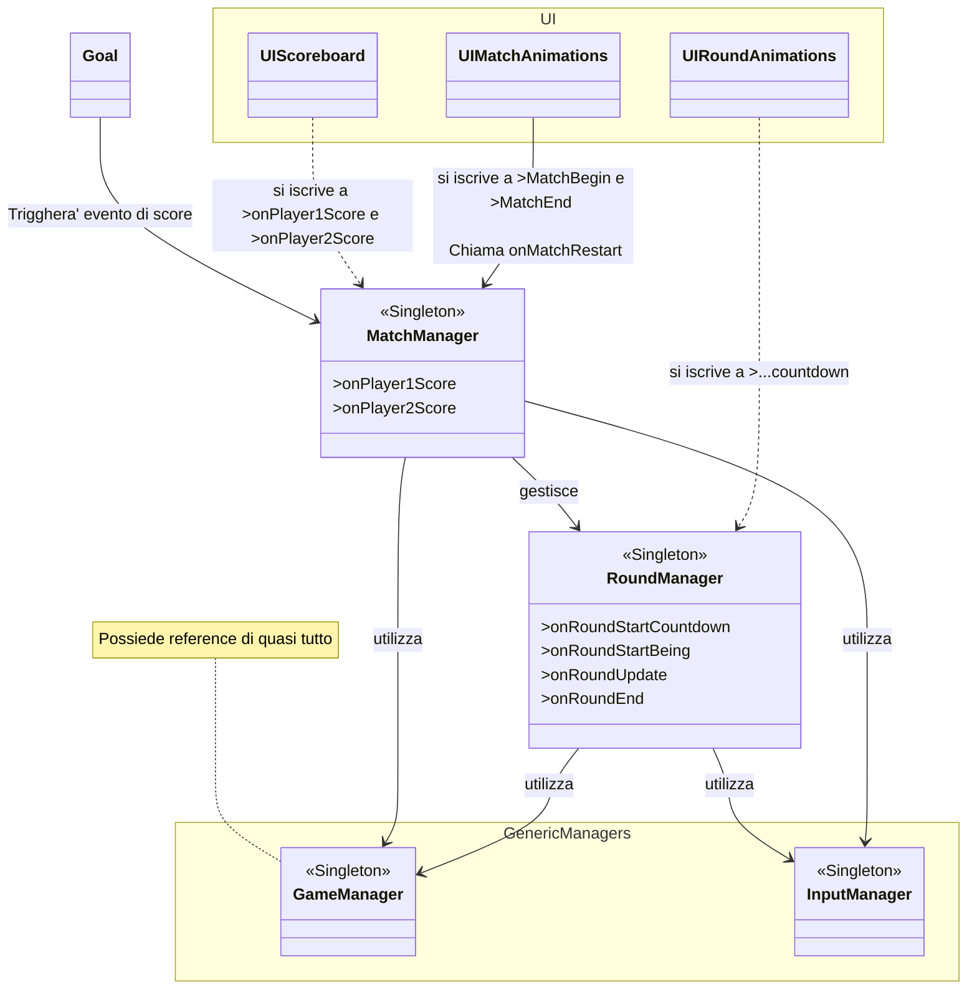

# Relazioni fra Managers

```mermaid
classDiagram


%% ---------------- Managers
namespace GenericManagers {
    class GameManager { 
        <<Singleton>>
    }

    class InputManager {
        <<Singleton>>
    }
}

class MatchManager {
    <<Singleton>>
    >onPlayer1Score
    >onPlayer2Score
}

class RoundManager {
    <<Singleton>>
    >onRoundStartCountdown
    >onRoundStartBeing
    >onRoundUpdate
    >onRoundEnd
}


Goal --> MatchManager : Trigghera' evento di score

MatchManager --> RoundManager : gestisce
MatchManager --> GameManager : utilizza

RoundManager --> GameManager : utilizza
RoundManager --> InputManager : utilizza

MatchManager --> InputManager : utilizza


note for GameManager "Possiede reference di quasi tutto"


%% ------------- UI
namespace UI {
    class UIScoreboard {
        
    }

    class UIRoundAnimations {

    }
    
   

    class UIMatchAnimations {

    }
}
UIScoreboard ..> MatchManager : si iscrive a >onPlayer1Score e >onPlayer2Score

UIRoundAnimations ..> RoundManager : si iscrive a >...countdown

UIMatchAnimations --> MatchManager : si iscrive a >MatchBegin e >MatchEnd <br/> <br/> Chiama onMatchRestart


```