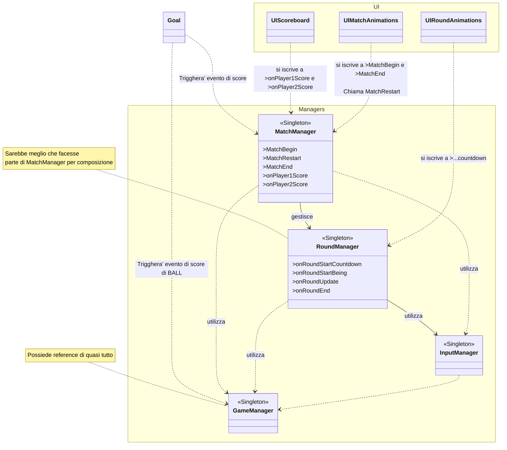

# Relazioni fra Managers

```mermaid
classDiagram


%% ---------------- Managers
namespace Managers {
    class GameManager { 
    <<Singleton>>
    }

    class InputManager {
        <<Singleton>>
    }

    class MatchManager {
        <<Singleton>>
        >MatchBegin
        >MatchRestart
        >MatchEnd
        >onPlayer1Score
        >onPlayer2Score
    }

    class RoundManager {
        <<Singleton>>
        >onRoundStartCountdown
        >onRoundStartBeing
        >onRoundUpdate
        >onRoundEnd
    }
}


Goal ..> MatchManager : Trigghera' evento di score

Goal ..> GameManager : Trigghera' evento di score di BALL

MatchManager --> RoundManager : gestisce
MatchManager ..> GameManager : utilizza

RoundManager ..> GameManager : utilizza
RoundManager --> InputManager : utilizza

MatchManager ..> InputManager : utilizza

InputManager ..> GameManager

note for GameManager "Possiede reference di quasi tutto"

note for RoundManager "Sarebbe meglio che facesse <br/> parte di MatchManager per composizione"

%% ------------- UI
namespace UI {
    class UIScoreboard {
        
    }

    class UIRoundAnimations {

    }
    
   

    class UIMatchAnimations {

    }
}
UIScoreboard ..> MatchManager : si iscrive a >onPlayer1Score e >onPlayer2Score

UIRoundAnimations ..> RoundManager : si iscrive a >...countdown

UIMatchAnimations ..> MatchManager : si iscrive a >MatchBegin e >MatchEnd <br/> <br/> Chiama MatchRestart


```