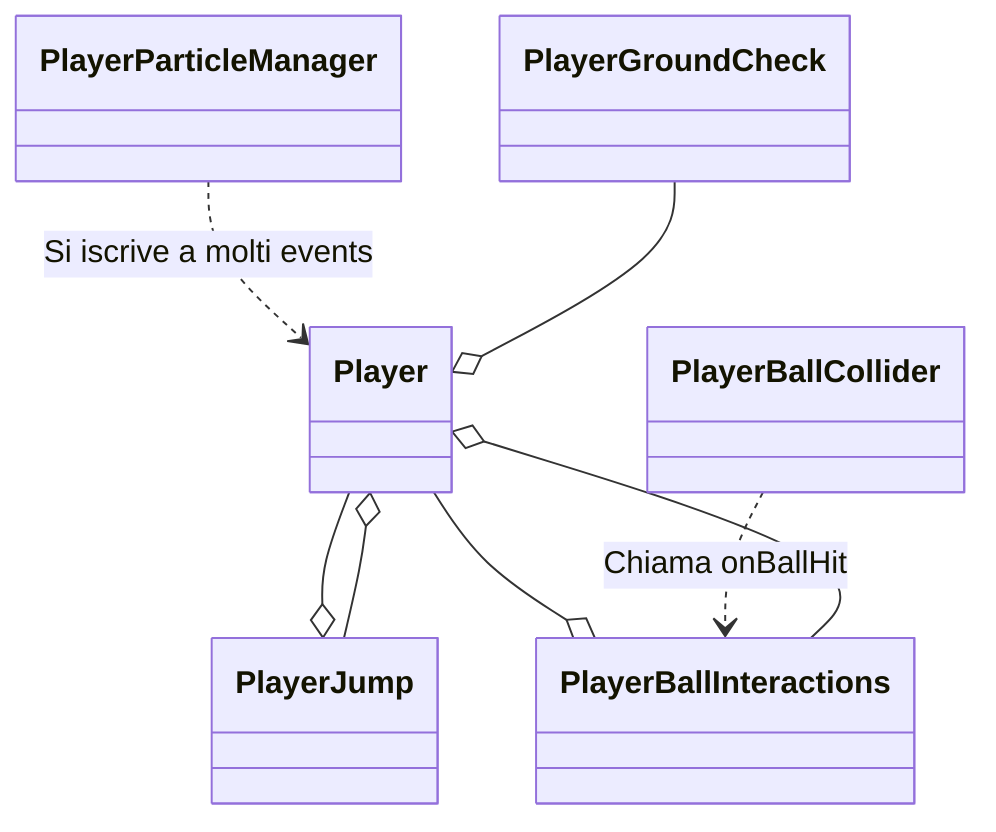

```mermaid
classDiagram

class Player {

}

class PlayerJump {

}

class PlayerBallInteractions {

}

class PlayerGroundCheck { 

}

class PlayerBallCollider {

}

class PlayerParticleManager {

}

PlayerParticleManager ..> Player : Si iscrive a molti events

PlayerGroundCheck --o Player

PlayerJump --o Player
PlayerBallInteractions --o Player

Player --o PlayerJump
Player --o PlayerBallInteractions

PlayerBallCollider ..> PlayerBallInteractions : Chiama onBallHit 


```