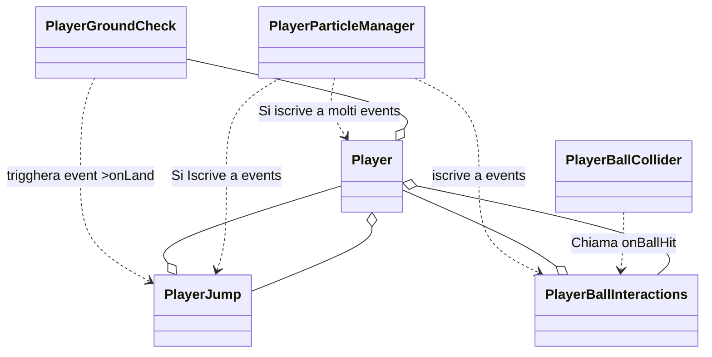

```mermaid
classDiagram

class Player {

}

class PlayerJump {

}

class PlayerBallInteractions {

}

class PlayerGroundCheck { 

}

class PlayerBallCollider {

}

class PlayerParticleManager {

}


PlayerGroundCheck ..> PlayerJump : trigghera event >onLand

PlayerParticleManager ..> Player : Si iscrive a molti events
PlayerParticleManager ..> PlayerBallInteractions : iscrive a events


PlayerGroundCheck --o Player

PlayerJump --o Player
PlayerBallInteractions --o Player

Player --o PlayerJump
Player --o PlayerBallInteractions

PlayerParticleManager ..> PlayerJump : Si Iscrive a events
PlayerBallCollider ..> PlayerBallInteractions : Chiama onBallHit 


```