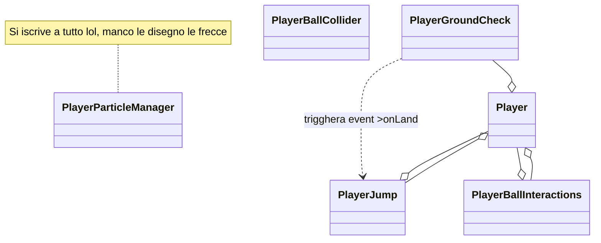

```mermaid
classDiagram

class PlayerParticleManager {

}
class Player {

}

class PlayerJump {

}

class PlayerBallInteractions {

}

class PlayerGroundCheck { 

}

class PlayerBallCollider {

}


PlayerGroundCheck ..> PlayerJump : trigghera event >onLand
PlayerGroundCheck --o Player

PlayerJump --o Player
PlayerBallInteractions --o Player

Player --o PlayerJump
Player --o PlayerBallInteractions


note for PlayerParticleManager "Si iscrive a tutto lol, manco le disegno le frecce"


```